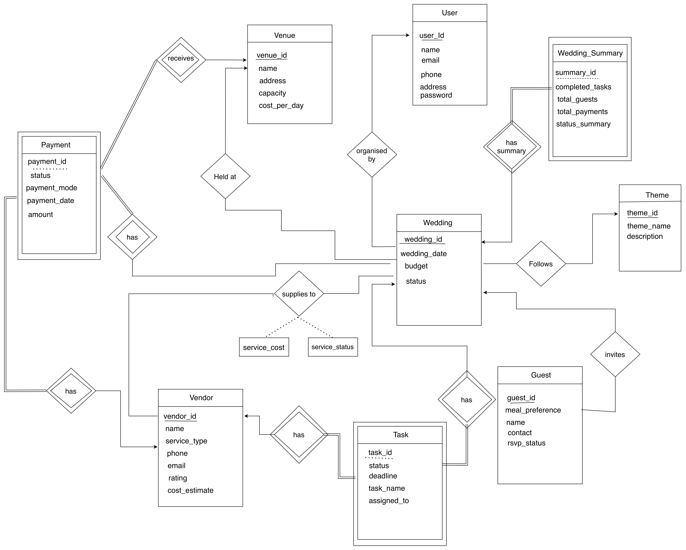
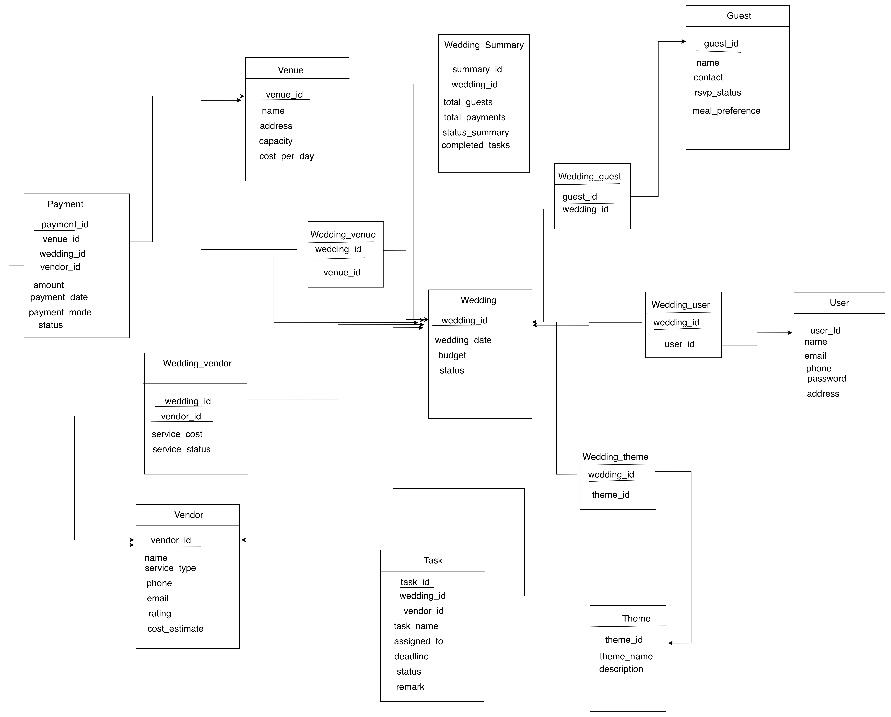

# Wedding Management System

A MySQL database for planning and tracking weddings: who organises each wedding, where it is held, its theme, the guest list, booked vendors, tasks, payments, and a per-wedding summary.

DBMS course project by **Saurabh Shrivastav** and **Vijay Singh Parihar**.

## Contents

| File | What it is |
| --- | --- |
| [`wedding_ddl.sql`](wedding_ddl.sql) | Creates the `wedding_management` database and its 14 tables |
| [`wedding_dml.sql`](wedding_dml.sql) | Sample data for 12 weddings: 5 users, 5 venues, 5 themes, 14 guests, 8 vendors, 16 tasks, 16 payments |
| [`wedding_functionality.sql`](wedding_functionality.sql) | Functional queries: wedding, guest, vendor, task and payment management, analytics, and combined reports |
| [`Wedding Management.pdf`](Wedding%20Management.pdf) | Project report: ER diagram, schema, and screenshots of the DDL, DML and functional queries |
| [`er_wedding.drawio.png`](er_wedding.drawio.png) | ER diagram |
| [`schema-wedding.drawio.png`](schema-wedding.drawio.png) | Relational schema |

## ER diagram



## Relational schema



| Kind | Tables |
| --- | --- |
| Entities | `User`, `Venue`, `Theme`, `Guest`, `Vendor`, `Wedding` |
| Weak entities | `Task`, `Payment`, `Wedding_Summary` |
| Relationships | `Wedding_user` (organised by), `Wedding_venue` (held at), `Wedding_theme` (follows), `Wedding_guest` (invites), `Wedding_vendor` (supplies, with `service_cost` and `service_status`) |

## Running it

Requires MySQL 8.0. Run the three scripts in order:

```bash
mysql -u root -p < wedding_ddl.sql
mysql -u root -p < wedding_dml.sql
mysql -u root -p < wedding_functionality.sql
```

Or open each file in MySQL Workbench and execute it. `wedding_functionality.sql` runs several `UPDATE`s and a one-time `INSERT` into `Wedding_Summary`, so to start over run `DROP DATABASE wedding_management;` and begin again from `wedding_ddl.sql`.

## Notes

- The `Wedding_Summary` insert was fixed after the report was made. It used to join guests, payments and tasks in one go, which multiplied the rows and inflated the totals. The last page of the report still shows the old numbers, e.g. ₹360000 and 8 completed tasks for wedding 1 instead of ₹90000 and 2.
- The report covers 35 of the 37 queries. "Full wedding overview" and "Vendor service utilization" are only in `wedding_functionality.sql`.
